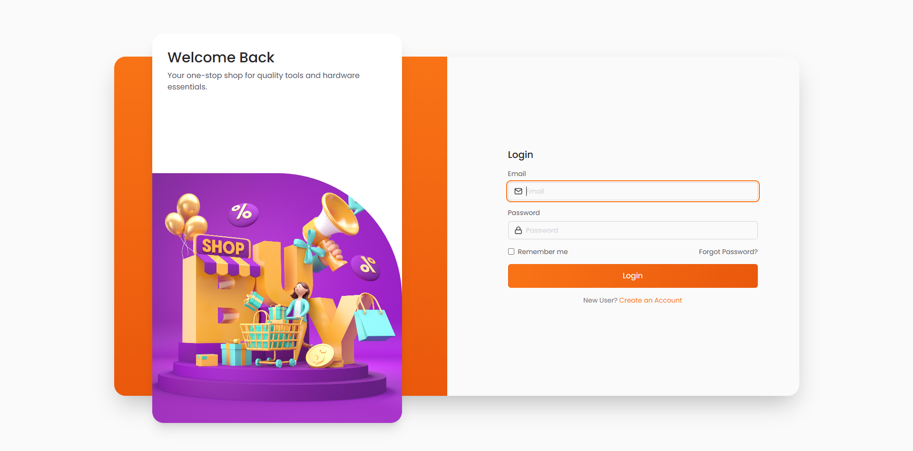
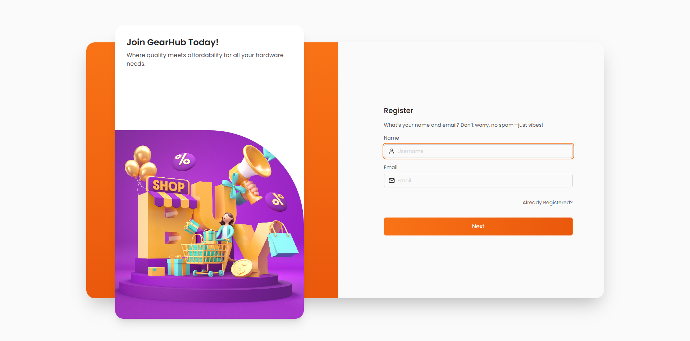
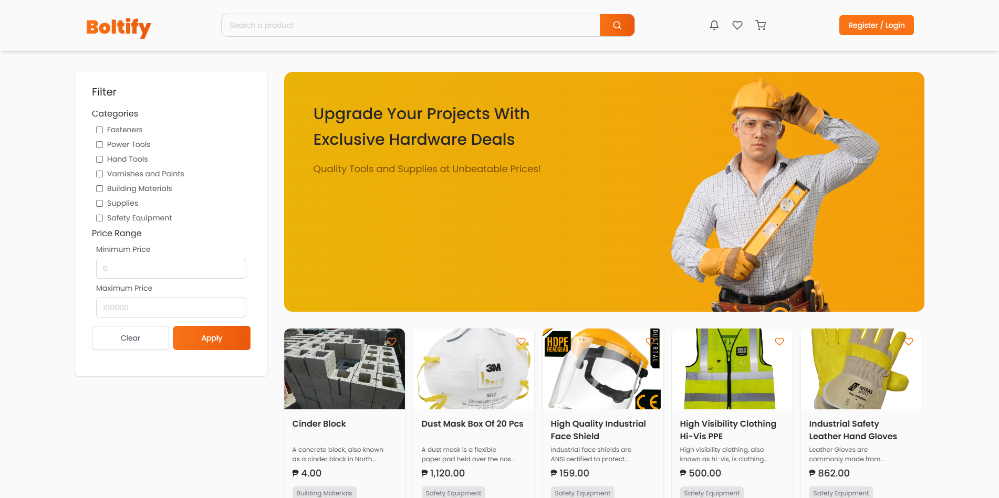
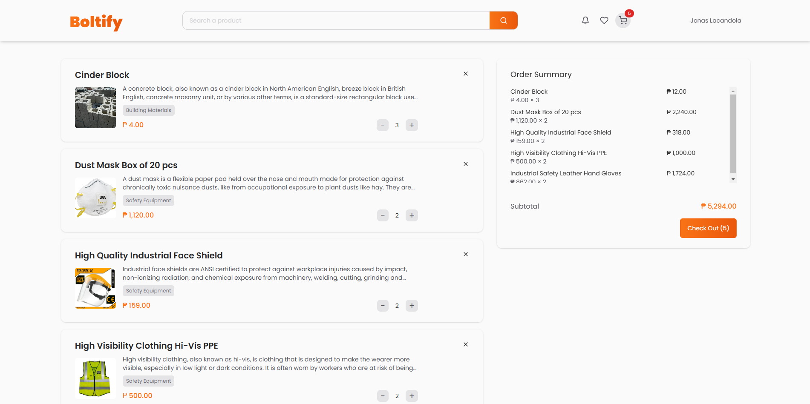
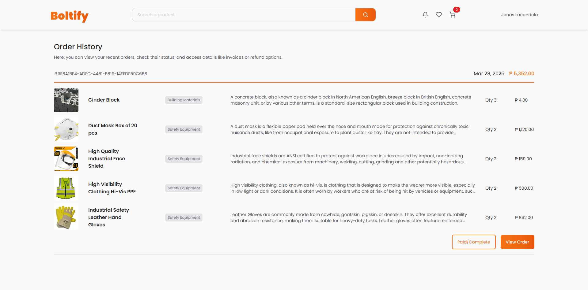

# Boltify - Hardware E-Commerce Platform

Boltify is an e-commerce platform built with Laravel, designed for hardware stores to sell products online efficiently. It provides features for product management, user authentication, order processing, and more.

## Features

-   **Product Management**: Add, edit, and remove hardware products.
-   **User Authentication**: Secure login and registration for customers.
-   **Shopping Cart & Checkout**: Seamless shopping experience with cart functionality and secure checkout.
-   **Order Management**: Track and manage customer orders.
-   **Payment Integration**: Supports various payment methods (Stripe, PayPal, etc.).
-   **Admin Dashboard**: Manage products, orders, and users with ease.
-   **Responsive Design**: Fully optimized for desktop and mobile devices.

## Technologies Used

-   **Backend**: Laravel (PHP framework)
-   **Frontend**: Blade templates, Tailwind CSS (or Bootstrap)
-   **Database**: MySQL
-   **Payment Gateway**: Stripe/PayPal (if integrated)
-   **Authentication**: Laravel Breeze / Laravel Jetstream (if used)

## Installation

1. **Clone the repository:**
    ```sh
    git clone https://github.com/yourusername/boltify.git
    cd boltify
    ```
2. **Install dependencies:**
    ```sh
    composer install
    npm install
    ```
3. **Configure environment:**
    - Copy `.env.example` to `.env`
    - Set up database credentials and other configurations
    ```sh
    cp .env.example .env
    php artisan key:generate
    ```
4. **Run database migrations:**
    ```sh
    php artisan migrate --seed
    ```
5. **Serve the application:**
    ```sh
    php artisan serve
    ```

## Usage

-   Visit `http://localhost:8000` in your browser.
-   Register/Login as a customer to browse and purchase products.
-   Access the admin panel (if applicable) to manage products and orders.

## Contributing

Contributions are welcome! Feel free to fork this repository and submit pull requests.

## License

This project is licensed under the MIT License.

## Contact

For any inquiries or issues, reach out at [your-email@example.com] or visit [your-website.com].

## Screenshots

### Login Page



### Register Page



### Product Page



### Cart Page



### Cart Page


### Order History Page


